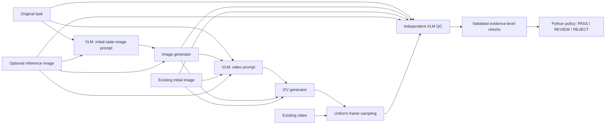

# Video_Gen_QC

A minimal experimental pipeline for **VLM-led quality inspection of generated
robot manipulation videos**: task → initial-state image prompt → image →
image-conditioned video prompt → video → independent QC.

**Default: fully offline mock providers.** The demo produces valid schematic PNG/MP4
fixtures. Mock providers perform no visual reasoning or task validation. Mock QC
has `is_mock: true`, three `uncertain` checks, and returns **REVIEW**. Real APIs need
explicit configuration **and** `--allow-paid`, including real VLM inspection calls.

## Research motivation and boundary

The research question is: **Does the visible video satisfy the requested task and
visual constraints?** Videos may eventually feed perception, trajectory extraction,
retargeting, or policy learning, but their outputs do not enter this evaluator.

> The QC system evaluates observable video quality and task compliance.
> It does not estimate robot executability.
> It does not use downstream manipulation success as a QC criterion.

Pose estimation success, simulation success, rewards, grasp outcomes, and robot
execution outcomes are neither inputs, quality criteria, nor evaluation ground truth.
QC receives the **original task directly**, optional reference/initial still images,
and sampled video frames. Generated prompts and generator self-evaluation are excluded.

## Architecture



| Mode | Inputs | Work performed |
| --- | --- | --- |
| Full | Task; optional reference image | Image prompt → generated/edited image → video prompt → video → QC |
| Existing image | Task + initial image | Video prompt → video → QC |
| QC-only | Task + video; optional still images | Sampling → QC |

QC-only never constructs or calls generation providers. Existing-image mode skips
both image prompting and image generation. Inactive providers need no credentials.
Image prompting, video prompting, and QC have separate system instructions and
stateless requests. A real provider service must preserve this context isolation.
The video-prompt request includes the **actual initial image bytes** and original
task, never the image prompt. Instructions preserve the task even when the image
conflicts with it (for example, the wrong handedness).

`--initial-image` is the exact starting frame and skips image generation.
In full mode, `--reference-image` also sends the actual reference pixels to Qwen
Image (or the HTTP image bridge) to generate/edit the initial frame. The resulting
`initial_image.png` is then supplied to both the video-prompt VLM and Wan.
With `--initial-image`, the reference is only context for the VLM and QC.
Wan receives one first frame: this option does not add a second reference image
to Wan. Its first-frame mode and separate reference-media mode are mutually exclusive.
The offline mock accepts a reference but does not simulate image editing.

For example, preserve an existing scene while adding a hand at a task-specified scale:

```bash
video-qc run --task examples/box_lift_scale.json \
  --reference-image path/to/scene.png \
  --config configs/aliyun-beijing.yaml --allow-paid
```

Use `image_generation.image_options.size` to match the desired aspect ratio
(for example `1280*960`). Put intended hand/box proportions in the original task
so both generation and independent QC receive them. Describe hand length and palm
width explicitly; “normal hand size” alone has no known physical scale in a still
image. Occlusion and perspective may still prevent QC from assessing a ratio.

The small `src/video_gen_qc` package separates `schemas`, `config`, `prompts`,
`frame_sampler`, `qc`, artifact handling, pipeline orchestration, CLI, and providers.
`qc.py` accepts only task/visual evidence and a VLM; it imports no generation adapter.

## Installation

Python 3.10+ is required. From a checkout:

```bash
python3 -m venv .venv
source .venv/bin/activate
python -m pip install -e '.[dev]'
video-qc --help
```

Alternatively: `uv venv` and `uv pip install -e '.[dev]'`. Dependencies are PyAV,
Pillow, Pydantic, PyYAML, HTTPX, and python-dotenv; development checks use pytest and Ruff. PyAV
wheels include video codec libraries on supported platforms, so no separate
`ffmpeg` command is required. Initial installation needs package access; subsequent
mock runs and tests need neither network access nor API credentials.

If macOS Python 3.13 skips an editable installation's `.pth` file as hidden, use
`python -m pip install '.[dev]'` or clear that file's hidden flag inside the virtual
environment. The package source is `src/video_gen_qc`.

## Offline demo and CLI

The requested default command creates a unique directory under `outputs/`:

```bash
video-qc run --task examples/box_lift.json
```

To try all modes with known paths, use new, nonexistent output directories:

```bash
# Mode A
video-qc run --task examples/box_lift.json --output-dir outputs/demo-full

# Mode B
video-qc run --task examples/box_lift.json \
  --initial-image outputs/demo-full/initial_image.png \
  --output-dir outputs/demo-existing-image

# Mode C
video-qc judge --task examples/box_lift.json \
  --video outputs/demo-full/video.mp4 \
  --output-dir outputs/demo-qc-only

# Optional context for QC
video-qc judge --task examples/box_lift.json \
  --video outputs/demo-full/video.mp4 \
  --initial-image outputs/demo-full/initial_image.png \
  --reference-image path/to/reference.png
```

Both subcommands accept `--config`, `--output-root`, `--output-dir`, and
`--allow-paid`. `--output-root` overrides the configured parent; `--output-dir`
specifies an exact directory and takes precedence. Existing directories are
rejected, never overwritten. `python -m video_gen_qc ...` is also supported.

Completed inspections exit `0`, including REVIEW and REJECT. Runtime errors exit
`2` with an explanation on stderr. Process success does not mean the video passed;
read the report's `decision` field.

## Task format

Use JSON or YAML. Only `task_id` and `instruction` are required; constraint/event
lists default to empty. Unknown fields, wrong types, and empty strings are rejected.
Describe forbidden actions in the instruction or constraints. See
[`examples/box_lift.json`](examples/box_lift.json) for the complete example.

```json
{
  "task_id": "box_lift_001",
  "instruction": "A right hand grasps the box, lifts it vertically from the table, and briefly holds it in the air.",
  "scene_constraints": ["camera remains fixed", "box appearance remains consistent"],
  "initial_state_constraints": ["box is upright on the table", "hand is not touching the box"],
  "required_events": ["hand approaches the box", "hand grasps the box", "box leaves the table"]
}
```

Task IDs are sanitized only for directory names. The authoritative task is saved
in every run and supplied directly to QC.

## Sampling, checks, and decisions

Uniformly sample **16 decoded frame indices** by default, including the first and
final frame. Short videos return all available frames without duplication; a
one-frame video returns one sample. Requested counts must be at least two.
Two sequential decoding passes provide bounded memory use and avoid trusting
container frame-count metadata. Uniformity is by index, not elapsed time for VFR.

Each saved sample has `frame_id`, `source_frame_index`, `timestamp_seconds`, and
relative `path`. Timestamps preserve source presentation timestamps (PTS); they
are not estimated by dividing index by FPS. Missing, negative, or non-monotonic
sampled timestamps cause runtime errors. Only the first video stream is inspected;
audio is ignored. **Unsampled moments are not inspected.**

| Required check | Scope |
| --- | --- |
| `task_compliance` | Initial state, correct target/action, event order, forbidden actions, final visible state |
| `scene_consistency` | Requested camera/background/layout consistency and visual identity; foreground motion is expected |
| `visual_anomalies` | Visibly supported disappearance, deformation, identity/scale changes, jumps, or severe artifacts |

Every check has `status`, `reason`, and `evidence_frames`:

- `pass`: no explicit violation found in inspected evidence.
- `fail`: visible evidence supports a violation.
- `uncertain`: available visual evidence is insufficient.

2D overlap does not confirm 3D penetration; occluded fingers are not missing
fingers; hidden contact is not incorrect contact. Large changes across widely
spaced samples alone do not establish an abrupt temporal jump. The VLM is instructed
to use `uncertain` when evidence is insufficient and never certify hidden physics.

For a fixed-camera task, camera position, orientation, focal length, field of view,
framing and crop must remain fixed. A smooth zoom or push-in is a scene-consistency
violation even when the wall/table identity is unchanged and the action succeeds.
The video-prompt instruction preserves these restrictions. QC compares stationary
background boundaries and table edges across early/middle/late samples, including
pre-contact frames, and describes concrete frame comparisons. Foreground motion or
shadow changes alone do not establish camera movement. Insufficient background
evidence calls for `uncertain`. A `scene_consistency` pass must cite at least two
distinct sampled frames; the validator rejects single-frame claims of consistency.
These instructions and evidence checks do not guarantee that a VLM detects every
violation. Keep human-identified false passes as evaluation cases.

Evidence refers to sampled **`frame_id`**, not source indices or still-image labels.
Nonexistent, negative, duplicate, boolean, or string IDs are rejected. Pass/fail
requires a cited sample; uncertain may have an empty list. Malformed JSON, missing
checks, extra fields, VLM-provided overall decisions, and numerical confidence
fields are rejected. There is no automatic repair, retry, or regeneration.

Python applies the deterministic policy after validating the VLM's checks:

```text
any required fail                     → REJECT
otherwise, any required uncertain     → REVIEW
otherwise                            → PASS
```

The report contains the task ID, decision, checks, `is_mock`, provider/model,
sampling manifest, and inspection-scope statement. No confidence or robotics scores.

## Artifacts and reproducibility

```text
outputs/<UTC timestamp>_<task ID>_<unique suffix>/
├── task.json
├── image_prompt_request.json
├── image_prompt.txt
├── initial_image.png
├── reference_image.png           # if supplied
├── video_prompt_request.json
├── video_prompt.txt
├── video.mp4                     # QC-only preserves input extension
├── sampled_frames.json           # IDs, original indices, PTS timestamps
├── sampled_frames/frame_000.png  # plus other sampled frames
├── qc_request.json               # isolated system instruction and evidence manifest
├── vlm_raw_response.json         # raw VLM text inside a JSON envelope
├── qc_report.json
└── run_metadata.json             # versions, config, inputs, hashes, status
```

QC-only omits generation prompts/requests and absent still images. Existing-image
mode omits image-prompt artifacts. Supplied images are decoded, EXIF-oriented, and
saved as RGB PNG; supplied videos are copied unchanged. The mock video holds the
initial image with a changing mock frame label; it does not simulate task success.

Metadata records configuration (environment variable **names**, never values),
active providers, input paths, UTC times, package/runtime versions, and SHA-256
hashes of artifacts. Each prompt request is saved separately. Invalid QC content is
saved before validation. Failed runs retain artifacts and `status: error`, with no
quality report or synthetic failure check. Early input/config/provider preflight
errors occur before an output directory exists.

## Real providers and configuration

[`configs/default.yaml`](configs/default.yaml) mirrors built-in defaults. No config
file is required for the installed CLI. Relative output paths resolve from the
working directory. To opt into real VLM inspection, create `configs/real.yaml`:

```yaml
vlm:
  provider: http
  model: your-vision-model
  endpoint_env: VIDEO_QC_VLM_URL
  api_key_env: VIDEO_QC_VLM_KEY
  timeout_seconds: 120.0
image_generation:
  provider: mock
video_generation:
  provider: mock
qc:
  sample_frames: 16
output:
  root: outputs
```

Set those environment variables using your shell, secret manager, or a project-local
`.env` file (see persistent configuration below). Then explicitly permit the real call:

```bash
video-qc judge --config configs/real.yaml --allow-paid \
  --task examples/box_lift.json --video path/to/video.mp4
```

### Direct Qwen VLM (Alibaba Cloud, China North 2 / Beijing)

Use [`configs/qwen-beijing.yaml`](configs/qwen-beijing.yaml) to call Qwen directly;
no bridge server or additional SDK is needed. This configuration selects a vision
model for the three isolated VLM operations and keeps image/video generation
as mock providers. The `qwen` provider supplies vision/text reasoning.
For a useful first real inspection, supply an existing video with `judge`.

```yaml
vlm:
  provider: qwen
  model: qwen3-vl-plus
  base_url: https://dashscope.aliyuncs.com/compatible-mode/v1
  api_key_env: DASHSCOPE_API_KEY
  timeout_seconds: 120.0
  max_tokens: 4096
```

To save your Key locally once, run this command from the project directory and
paste the current Key at the hidden prompt:

```bash
video-qc configure
```

The command creates or updates `.env`, preserves other entries/comments, and gives
the file owner-only permissions (`0600`). It prints only the file path, never the Key.
Future CLI invocations load it into the process environment automatically.
Then opt in to a real inspection:

```bash
video-qc judge --config configs/qwen-beijing.yaml --allow-paid \
  --task examples/box_lift.json --video path/to/video.mp4
```

`base_url` is the compatible API root; the adapter appends `/chat/completions`.
Alternatively, omit `base_url` and use `endpoint_env` to name an environment variable
containing the full POST URL. Configuring both is rejected. For a workspace-specific
Beijing endpoint, replace the base URL with
`https://<WorkspaceId>.cn-beijing.maas.aliyuncs.com/compatible-mode/v1`.
The configured legacy Beijing domain remains supported according to the
[official Qwen vision API documentation](https://help.aliyun.com/zh/model-studio/qwen-vl-compatible-with-openai).
Keep the key and endpoint in the same region; model access still depends on the account.

Every request sends only a fresh system/user pair. Actual PNG bytes are encoded as
data URLs, each preceded by its image/frame label. The adapter uses non-streaming,
non-thinking mode and requests `response_format: {type: json_object}` for QC only,
following the [structured-output documentation](https://help.aliyun.com/zh/model-studio/qwen-structured-output).
Other vision models must support these options. Prompt generation returns plain text.
Only final `message.content` is returned; reasoning content is not propagated.
Truncation, refusal, malformed responses, and HTTP failures are runtime errors.
Normal QC JSON is still saved and validated by the independent QC module; JSON
mode does not replace schema/evidence validation or determine the overall decision.

The adapter and wire format are tested with offline transports. No real key or
live service response is used in the test suite, and no account/model-access or
judgment-accuracy claim follows from passing these tests. `max_tokens` controls
Qwen completion length; increase it if the service reports truncation.

### Full Alibaba Cloud pipeline: Qwen + Qwen Image + Wan

[`configs/aliyun-beijing.yaml`](configs/aliyun-beijing.yaml) selects three real models:

| Stage | Provider | Model |
| --- | --- | --- |
| Image prompt, image-conditioned video prompt, independent QC | `qwen` | `qwen3.8-max` |
| Initial-state image | `qwen_image` | `qwen-image-3.0-pro` |
| Video conditioned on that exact image | `wan` | `wan3.0-video` |

All three read **the same `DASHSCOPE_API_KEY`** from the project `.env`. A key can
authorize multiple models; access depends on its workspace and region. The model
catalogue and choices are explained in [the Alibaba model guide](docs/aliyun-models.md).
The compatible Chat API uses `/compatible-mode/v1`; native image/video APIs use
`/api/v1`. These are separate paths on the same regional service. No extra SDK is needed.

From the repository with the local Key already saved:

```bash
video-qc run --config configs/aliyun-beijing.yaml --allow-paid \
  --task examples/box_lift.json
```

This requests one 1024×1024 PNG and one 5-second 720P video, with audio off, then
inspects 16 sampled frames. It makes three independent VLM calls, one synchronous
image-generation request, and one asynchronous video submission. Provider prompt
rewriting is disabled so the saved VLM prompts are the generation inputs. QC still
receives only the original task and actual visual evidence, not either prompt.
Using the same VLM for prompting and QC does not establish evaluator accuracy or
remove possible model-family bias; evaluate that separately with labelled examples.

Change `image_generation.model` between `qwen-image-3.0-pro` and `qwen-image-3.0`,
or `video_generation.model` between `wan3.0-video` and `wan3.0-video-prime`. Older
Qwen Image and Wan versions can use different request schemas and are not accepted
by these media adapters. Other vision models can be configured in `vlm.model` when
they support images, non-thinking Chat requests, and JSON output.

`image_options` controls size, prompt rewriting and optional seed. `video_options`
controls resolution, duration (2–30 seconds), audio, prompt rewriting, optional seed,
polling interval and task wait timeout. Image count is fixed at one. Video aspect
ratio follows the actual first frame. File size, duration and input-image constraints
are checked; final video decoding occurs before the QC request.

Wan is submitted once and queried every 15 seconds, for up to 900 seconds by default.
`video_generation_job.json` preserves the model, task ID and last service status as
soon as a job is accepted. Timeout, service failure or download failure never causes
resubmission or a mock fallback. The image request has a 600-second HTTP timeout;
an ambiguous timeout must be checked in the console before another paid generation.

To recover an existing Wan job, use its saved task ID with the provider's `resume`
method. This only queries and downloads; it never submits a new video. Run from the
repository and substitute the directory of the failed run:

```python
import json
from pathlib import Path
from video_gen_qc.config import load_config
from video_gen_qc.environment import load_environment
from video_gen_qc.providers.dashscope import WanVideoGenerator

config_path = Path("configs/aliyun-beijing.yaml")
load_environment(config_path)
config = load_config(config_path)
run = Path("outputs/your-failed-run")
job = json.loads((run / "video_generation_job.json").read_text())
provider = WanVideoGenerator(config.video_generation, allow_paid=True)
provider.resume(job["task_id"], run / "video.mp4")
```

Use `video-qc judge` on the recovered video to create a new independent QC report.
The earlier error record is preserved. Resuming requires the original region,
workspace and Key; service task IDs and result URLs expire after 24 hours.
Downloads use no API credential headers, do not follow redirects, have bounded
size, and are saved locally. Signed result URLs and service error bodies are omitted
from logs and metadata. Tests use offline HTTP transports, never personal keys.

API references: [Qwen Image 3.0](https://help.aliyun.com/zh/model-studio/qwen-image-generation-and-editing-api-reference),
[Wan 3.0](https://help.aliyun.com/zh/model-studio/wan3-video-generation-api-reference).

### Persistent local configuration

Model names, endpoints, and frame counts remain in YAML. Keys stay in `.env` and
reach providers only through environment variables. `.env` is ignored by Git;
`.env.example` contains empty placeholders and may be committed. You can also copy
the example and edit `.env` manually. This file is local plaintext with restricted
permissions, so keep it outside artifacts or shared files.

For `run` and `judge`, the CLI locates the repository root from the selected
`--config` file, or from the working directory when no config is supplied. It loads
that root's `.env`. If no project root is found, only the config file's directory
(or the working directory) is checked; unrelated ancestor `.env` files are not loaded.
This works after moving the repository; no machine-specific paths are hard-coded.

Use `--env-file /path/to/local.env` on `run`, `judge`, or `configure` to select a
different file. An explicitly selected input file must exist. A missing automatic
`.env` is allowed, so offline defaults still work immediately after installation.
Existing shell variables take precedence, including empty values; unset a stale
shell variable to use the saved value. Set `PYTHON_DOTENV_DISABLED=1` to disable
loading. Values are parsed as data without shell execution or variable expansion.
Direct Python callers can explicitly call `video_gen_qc.environment.load_environment`.

Saving a Key does not enable real providers or bypass `--allow-paid`. Tests disable
personal `.env` discovery and use temporary test files for persistence checks.

### Generic HTTP bridge

`http` implements a **provider-neutral bridge contract defined by this project**.
It is not a drop-in vendor endpoint. Supply a compatible service, or implement the
small interfaces in `providers/base.py` for a chosen vendor and register them in
`providers/factory.py` and `ProviderConfig`. Live vendor integration and model
accuracy have not been validated by the offline tests.

### HTTP bridge contract

Each call is one synchronous POST with `Authorization: Bearer <environment key>`.
URLs must be HTTPS (local HTTP is allowed), without embedded credentials, query
strings, or fragments. There are no redirects, retries, polling, or URL downloads.
A vendor bridge may handle asynchronous vendor jobs internally; configure its timeout.

VLM request:

```json
{
  "model": "your-vision-model",
  "purpose": "video_prompt",
  "system": "Distinct instruction for this purpose",
  "text": "JSON string with original_task and, for QC, sampling and image_labels",
  "images": [{"label": "initial_image", "mime_type": "image/png", "data_base64": "..."}]
}
```

VLM response: `{"text": "generated prompt or QC JSON encoded as a string"}`.
Purposes are `image_prompt`, `video_prompt`, and `qc`. QC image labels are optional
`reference_image`/`initial_image` and `frame_0`, `frame_1`, etc. The bridge must pass
actual bytes to a vision-capable model, retain labels, and never inject generation
history into QC. A QC response's text must encode this exact shape:

```json
{
  "checks": {
    "task_compliance": {"status": "uncertain", "reason": "Required contact is occluded in the available samples.", "evidence_frames": [5]},
    "scene_consistency": {"status": "pass", "reason": "No clear background change is visible in these samples.", "evidence_frames": [0, 15]},
    "visual_anomalies": {"status": "uncertain", "reason": "The interaction region is not sufficiently visible.", "evidence_frames": [5]}
  }
}
```

For generators, configure `provider: http`, `model`, `endpoint_env`, `api_key_env`,
and optionally `timeout_seconds` in the corresponding section:

| Operation | Request fields (in addition to `model`) | Response |
| --- | --- | --- |
| Image | `purpose: image_generation`, `prompt`, optional `reference_image` (same labeled image object above) | `{"image_base64": "<image bytes>"}` |
| Video | `purpose: video_generation`, `prompt`, `initial_image` (same labeled image object above) | `{"video_base64": "<MP4 bytes>"}` |

The image adapter decodes and saves PNG. The sampler validates returned videos
before QC. All active real providers are preflighted before the first call.
Missing secrets, failed requests, invalid media, and invalid VLM responses are
runtime errors; no API call is faked or replaced by a mock success. HTTP errors
omit response bodies/URLs that might echo secrets. No credentials were used in V1 testing.

## Verification

```bash
python -m ruff check .
python -m ruff format --check .
python -m pytest -q
video-qc run --task examples/box_lift.json
```

Tests cover parsing, endpoints/counts/PTS including variable frame rates, all 27
decision-policy combinations, evidence/schema rejection, all CLI modes, actual-image
conditioning, context isolation, skipped providers, paid gates, error artifacts,
and HTTP handling through in-process mock transports. Network socket connections
are blocked throughout the suite. These tests validate behavior, not VLM accuracy.

## Limitations, extension points, and future evaluation

V1 has no adaptive sampling, segmentation, optical flow, CLIP scoring, 3D/pose
estimation, simulation, robot control, learning, multi-agent framework, or prompt
regeneration loop. Sixteen frames can miss brief defects. There is no dense-video
or audio reasoning, confidence calibration, or evaluation benchmark. Long videos
require two sequential decode passes; the simple HTTP bridge sends media inline.

The sampler can later support adaptive/dense inspection around interaction moments.
Independent QC request construction and provider interfaces allow optional tools
for background changes, camera motion, hand/object detection, scale consistency,
and CLIP auxiliary signals, plus multi-model comparisons and separate regeneration
experiments. These are future extensions; the VLM remains the primary reasoning
layer and the original task remains authoritative.

Future evaluation compares QC predictions against **human video annotations**, not
robot execution. Build a held-out annotated dataset with per-defect labels, visible
evidence locations, and annotator uncertainty. Measure per-defect precision/recall/F1,
bad-video false acceptance, good-video retention, REVIEW rate, and evidence-localization
correctness, accounting for sampling limits. No such accuracy claims are made by V1.

The [2026-09-11 hand-scale experiment](docs/evaluations/hand-scale-ab-20260911.json)
records a real limitation: both outputs received automatic PASS without discussing
the task's explicit size targets, and the reference-conditioned output contained
a visible forearm cutoff missed by QC. Neither result establishes that the scale
problem is solved. Keep these cases for later coverage evaluation; passing schema
validation and offline tests does not establish VLM judgment accuracy.
